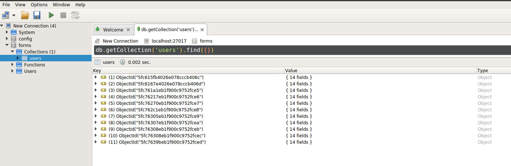

# API RestFul with Angular

## Installation

* First you need to clone this repo in your web server
* You should install nodejs, npm, angular and mongodb if you do not have installed yet.
* Install NodeJS and NPM: Go to https://nodejs.org/en/download/ and download source code or pre-built installer of LTS version. NPM is included.
* To check the installation execute the next code:
```bash
node -v
npm -v
```
* Install MongoDB: You need to install the Community Edition. Follow the installation process of our Operating System (https://docs.mongodb.com/manual/administration/install-on-linux/)
* Install Angular: Run the next code:
```bash
npm install -g @angular/cli
```
## How to use

1. MongoDB has to be running. In the installation process you can find how to start mongodb and how to check that you have started it.
2. NPM has to be running too. Go to the directory where you have clone this repo and run the code below. This process can not be killed.
```bash
cd backend
npm start
```
3. You will see the next message:
```bash
[nodemon] 2.0.6
[nodemon] to restart at any time, enter `rs`
[nodemon] watching path(s): *.*
[nodemon] watching extensions: js,mjs,json
[nodemon] starting `node index.js`
Port connected to: 8080
Database connected
```
4. Once you have NPM (the backend) and mongoDB (the database) running, to check that all is working, install robo3t, a software to visualize mongoDB databases.

5. Go to form-app-angular and run the next code. This will open a localhost where you an check that all is working. Go to the localhost and response the form with one toy example.
```bash
ng serve
```

6. Open robo3t, open the conection on port 27017 (by default) and check that form database has been created and you have one entry

